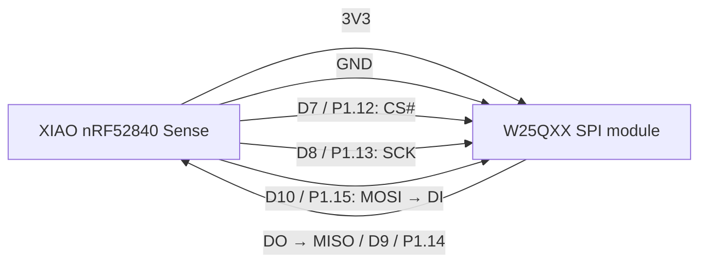

# W25QXX SPI Bring-up Test on Seeed Studio XIAO nRF52840 Sense

## 1. Purpose

This document defines a **small, repeatable hardware test** for an external
W25QXX SPI flash breakout board connected to a Seeed Studio XIAO nRF52840
Sense.

The test does not upload bytes directly from the laptop to the W25QXX. The
workflow is:

```text
Laptop --(SWD / UF2)--> XIAO firmware
XIAO firmware --(SPI)--> W25QXX external flash
```

The firmware reads a reserved test location in the W25QXX:

- If `Hello World` is already present, it prints: `Hello World sudah tersimpan`.
- If it is absent or different, it prints: `Hello World belum tersimpan; memasukkan Hello World`, erases **only one reserved 4 KB sector**, writes the text, reads it back, and verifies it.
- After reset/power-cycle, the second boot must report that the text is already stored. That proves non-volatile storage, not merely SPI activity.

> This is a bring-up test. Do not use its test sector later for voice assets,
> MCUboot secondary image, or production metadata.

---

## 2. Confirm the actual flash capacity first

The label `W25QXX` is a family name, not a guaranteed capacity. Many common
breakout boards use **W25Q64**, which is 64 Mbit = **8 MiB**. Do not assume it
without reading the marking on the IC or its JEDEC ID.

Common Winbond density byte examples:

| Part | Capacity | Typical JEDEC ID |
|---|---:|---|
| W25Q16 | 2 MiB | `EF 40 15` |
| W25Q32 | 4 MiB | `EF 40 16` |
| W25Q64 | 8 MiB | `EF 40 17` |
| W25Q128 | 16 MiB | `EF 40 18` |

`0x9F` is the **Read JEDEC ID** command. The test configuration below assumes
W25Q64 only after the ID is confirmed. If the density byte differs, update the
`jedec-id` and `size` properties in the overlay before relying on the driver.

---

## 3. Wiring: XIAO nRF52840 Sense to six-pin W25QXX module

Use **3.3 V only**. Do not power a bare 3.3 V W25QXX module from 5 V.

| W25QXX module pin | Meaning | XIAO silk label | nRF52840 GPIO |
|---|---|---|---|
| `VCC` | Supply | `3V3` | — |
| `GND` | Ground | `GND` | — |
| `CS` | Chip select, active-low | `D7` | `P1.12` |
| `SLK` / `CLK` | SPI clock | `D8` / `SCK` | `P1.13` |
| `DO` | Flash output → MCU input (MISO) | `D9` / `MISO` | `P1.14` |
| `DI` | Flash input ← MCU output (MOSI) | `D10` / `MOSI` | `P1.15` |



Notes:

- `SLK` on inexpensive modules is normally a typo/abbreviation for `SCLK`.
- The six-pin module exposes **standard SPI only**: CS, SCK, MOSI/DI, and
  MISO/DO. It cannot use four-data-line QSPI because IO2/WP# and IO3/HOLD# are
  not exposed.
- Do **not** connect this breakout to the XIAO's SWD pads. SWD is exclusively
  for programming/debugging the MCU; SPI is the data interface to the flash.
- Keep jumpers short for the first test. Start at 8 MHz or lower; do not begin
  at the flash's headline maximum frequency.

---

## 4. What is actually being flashed?

There are two distinct actions:

| Action | Tool/path | Destination |
|---|---|---|
| Install test firmware | `west flash`, UF2, or OpenOCD via SWD | XIAO **internal** nRF52840 flash |
| Store `Hello World` / voice bytes | The running firmware sends SPI NOR commands | External W25QXX flash |

For the external flash, the firmware/driver performs the normal NOR sequence:

```text
read → determine whether data is present
if write required:
    Write Enable (0x06)
    4 KB Sector Erase (0x20)
    wait until WIP bit is clear
    Page Program (0x02, maximum 256 bytes per page)
    wait until WIP bit is clear
read back (0x03 or fast-read) → compare
```

Using Zephyr's `flash_erase()`, `flash_write()`, and `flash_read()` is preferred
over hand-writing each command. The `jedec,spi-nor` driver performs the command,
page-boundary, write-enable, and busy-polling work.

---

## 5. Zephyr/NCS test application structure

Create a small standalone application, for example:

```text
w25qxx_xiao_test/
├── CMakeLists.txt
├── prj.conf
├── app.overlay
└── src/
    └── main.c
```

### 5.1 `prj.conf`

```conf
CONFIG_SPI=y
CONFIG_FLASH=y
CONFIG_SPI_NOR=y
CONFIG_SPI_NOR_SFDP_RUNTIME=y

CONFIG_PRINTK=y
CONFIG_CONSOLE=y
CONFIG_UART_CONSOLE=y
CONFIG_MAIN_STACK_SIZE=2048
```

If the project already uses USB CDC for logs, keep its existing USB CDC
configuration. The test logic below uses `printk()`, so it works with whichever
console transport is already selected: USB CDC, UART, or RTT.

### 5.2 `app.overlay` — W25Q64 example

This overlay uses SPI3 and the XIAO pins in the wiring table. It is deliberately
standard SPI, not nRF QSPI.

```dts
#include <zephyr/dt-bindings/gpio/gpio.h>
#include <zephyr/dt-bindings/pinctrl/nrf-pinctrl.h>

/ {
    aliases {
        spi-flash0 = &w25qxx;
    };
};

&pinctrl {
    spi3_default: spi3_default {
        group1 {
            psels = <NRF_PSEL(SPIM_SCK, 1, 13)>,
                    <NRF_PSEL(SPIM_MOSI, 1, 15)>,
                    <NRF_PSEL(SPIM_MISO, 1, 14)>;
        };
    };

    spi3_sleep: spi3_sleep {
        group1 {
            psels = <NRF_PSEL(SPIM_SCK, 1, 13)>,
                    <NRF_PSEL(SPIM_MOSI, 1, 15)>,
                    <NRF_PSEL(SPIM_MISO, 1, 14)>;
            low-power-enable;
        };
    };
};

&spi3 {
    status = "okay";
    pinctrl-0 = <&spi3_default>;
    pinctrl-1 = <&spi3_sleep>;
    pinctrl-names = "default", "sleep";
    cs-gpios = <&gpio1 12 GPIO_ACTIVE_LOW>;

    w25qxx: flash@0 {
        compatible = "jedec,spi-nor";
        reg = <0>;
        spi-max-frequency = <8000000>;

        /* Use these values only after 0x9F confirms EF 40 17. */
        jedec-id = [ef 40 17];
        size = <0x4000000>;  /* 64 Mbit = 8 MiB; binding unit is bits */
    };
};
```

If the module reports `EF 40 18` instead, it is W25Q128: set `jedec-id = [ef 40 18]`
and `size = <0x8000000>` (128 Mbit = 16 MiB). Do not merely rename the node.

### 5.3 `src/main.c` — persistence test

```c
#include <zephyr/device.h>
#include <zephyr/devicetree.h>
#include <zephyr/drivers/flash.h>
#include <zephyr/kernel.h>
#include <zephyr/sys/util.h>
#include <string.h>

#define TEST_OFFSET       0x001000  /* dedicated sector; 4 KB aligned */
#define TEST_SECTOR_SIZE  0x001000

static const char expected[] = "Hello World";
static char readback[sizeof(expected)];

static bool is_blank(const uint8_t *buf, size_t len)
{
    for (size_t i = 0; i < len; i++) {
        if (buf[i] != 0xFF) {
            return false;
        }
    }
    return true;
}

int main(void)
{
    const struct device *flash = DEVICE_DT_GET(DT_ALIAS(spi_flash0));
    int err;

    if (!device_is_ready(flash)) {
        printk("ERROR: W25QXX device is not ready\n");
        return 0;
    }

    err = flash_read(flash, TEST_OFFSET, readback, sizeof(readback));
    if (err) {
        printk("ERROR: flash_read failed: %d\n", err);
        return 0;
    }

    if (memcmp(readback, expected, sizeof(expected)) == 0) {
        printk("Hello World sudah tersimpan\n");
        return 0;
    }

    if (is_blank((const uint8_t *)readback, sizeof(readback))) {
        printk("Hello World belum tersimpan; memasukkan Hello World\n");
    } else {
        printk("Test sector contains different data; replacing only test sector\n");
    }

    err = flash_erase(flash, TEST_OFFSET, TEST_SECTOR_SIZE);
    if (err) {
        printk("ERROR: sector erase failed: %d\n", err);
        return 0;
    }

    err = flash_write(flash, TEST_OFFSET, expected, sizeof(expected));
    if (err) {
        printk("ERROR: write failed: %d\n", err);
        return 0;
    }

    memset(readback, 0, sizeof(readback));
    err = flash_read(flash, TEST_OFFSET, readback, sizeof(readback));
    if (err || memcmp(readback, expected, sizeof(expected)) != 0) {
        printk("ERROR: readback verification failed: %d\n", err);
        return 0;
    }

    printk("PASS: Hello World berhasil ditulis dan diverifikasi\n");
    printk("Reset/power-cycle board: boot berikutnya harus mengatakan tersimpan\n");
    return 0;
}
```

This test intentionally erases only `0x001000`–`0x001FFF`. Do not change the
offset to `0x000000` unless the entire external flash is known to be disposable.

---

## 6. Build, flash the MCU firmware, and observe the result

Build for the same XIAO target already used in the project:

```bash
west build -b xiao_ble/nrf52840/sense -p always .
```

Install the resulting **firmware** into the XIAO. One direct SWD/OpenOCD option
from the build output directory is:

```bash
openocd \
  -f interface/stlink.cfg \
  -c "transport select swd" \
  -f target/nordic/nrf52.cfg \
  -c "adapter speed 100; program zephyr.hex verify reset exit"
```

This command programs only the `zephyr.hex` firmware image selected by the
build. It does **not** directly program the W25QXX module. On boot, the XIAO
firmware accesses the W25QXX through the D7–D10 SPI wires.

Expected sequence:

```text
First boot:
Hello World belum tersimpan; memasukkan Hello World
PASS: Hello World berhasil ditulis dan diverifikasi

After reset or power-cycle:
Hello World sudah tersimpan
```

If the first run fails, stop before moving to voice files. Common causes are
swapped `DO`/`DI`, a loose CS wire, VCC connected to 5 V, an incorrect capacity
entry in the overlay, or a missing pinctrl/SPI node.

---

## 7. Next test: voice upload algorithm (discussion scope)

After the persistence test passes, voice uploading should use the same flash
driver but a different data format. The laptop does not need direct access to
the W25QXX; the XIAO receives bytes through USB CDC and writes them over SPI.

Recommended algorithm to discuss before implementation:

```text
PC uploader sends package header
    magic, format version, total byte count, CRC32, asset table
XIAO validates header and checks free partition size
XIAO erases the target sectors
PC sends chunks (for example 256 B or 1 KB)
XIAO writes each chunk and returns ACK / error
XIAO verifies final CRC32 over stored data
XIAO marks package valid only after CRC passes
```

Important rules:

1. Reserve a defined flash partition for assets; never overlap test data,
   MCUboot/OTA partitions, or configuration data.
2. NOR flash can change bits from `1` to `0` by programming, but changing
   `0` back to `1` requires an erase. Erase before rewriting a sector.
3. Page Program is at most 256 bytes per page. A higher-level uploader may use
   larger chunks, but its driver must split writes at page boundaries.
4. Do not declare an upload valid until size and CRC both pass.
5. The six-wire breakout is suitable for functional SPI testing. It is not a
   final performance reference for the Kache PCB's native QSPI wiring.

---

## 8. Reference assessment

| Reference | Relevance to this test |
|---|---|
| [Zephyr JEDEC SPI-NOR sample](https://docs.zephyrproject.org/latest/samples/drivers/spi_flash/README.html) | **Primary implementation reference.** Uses Zephyr flash API and validates erase/write/readback. |
| [Zephyr `jedec,spi-nor` binding](https://docs.zephyrproject.org/latest/build/dts/api/bindings/mtd/jedec,spi-nor.html) | **Primary configuration reference.** Defines `spi-max-frequency`, `jedec-id`, `size`, and optional WP/HOLD/reset GPIO properties. |
| [Nordic DevZone: external W25QXX validation](https://devzone.nordicsemi.com/f/nordic-q-a/97957/how-to-connnect-external-flash-w25qxx-to-nrf52833dk-board-and-validate-that-it-the-spi-communication-has-been-enabled) | **Relevant Nordic/NCS precedent.** It recommends the Zephyr SPI flash sample and a board-specific devicetree overlay. |
| [Kendryte W25QXX example](https://www.kendryte.com/k230_rtos/en/v0.8/app_develop_guide/peripheral/spi_w25qxx.html) | Relevant for universal W25QXX behavior: wiring, JEDEC ID, erase/write/read verification, 256-byte pages, and 4 KB erase sectors. **Not reusable as nRF/Zephyr code.** |
| [EmbeddedExpert STM32 W25QXX article](https://blog.embeddedexpert.io/?p=2142) | Relevant for generic SPI mode and command-level understanding. **Not reusable as nRF/Zephyr code.** |
| [Winbond W25Q product family](https://www.winbond.com/hq/product/code-storage-flash/qspi-nor/?__locale=en) | Use this to obtain the exact datasheet only after reading the part marking / JEDEC ID. |

## 9. Completion criteria

The W25QXX SPI wiring is considered validated only when all statements below are true:

- The application builds with the external `jedec,spi-nor` node enabled.
- The first boot erases, writes, reads, and verifies `Hello World`.
- A reset or full power-cycle reports `Hello World sudah tersimpan` without
  rewriting it.
- The module is confirmed to be powered from 3.3 V.
- The observed JEDEC ID agrees with the overlay capacity configuration.

